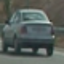
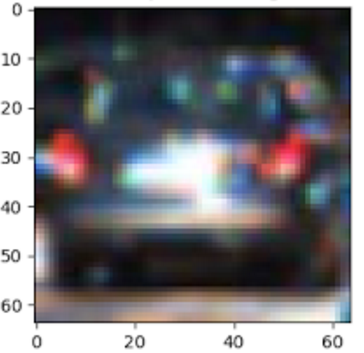
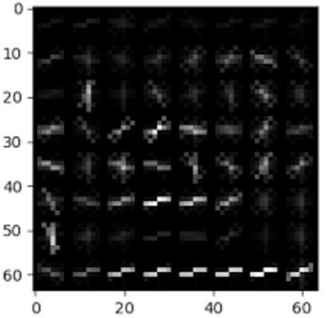
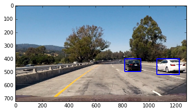
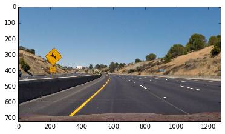
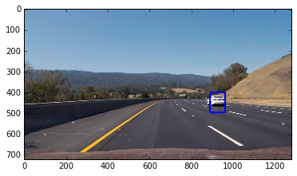
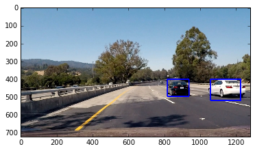
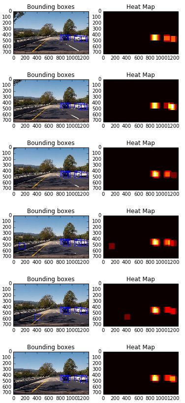
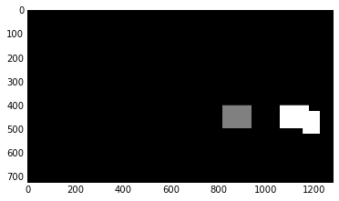
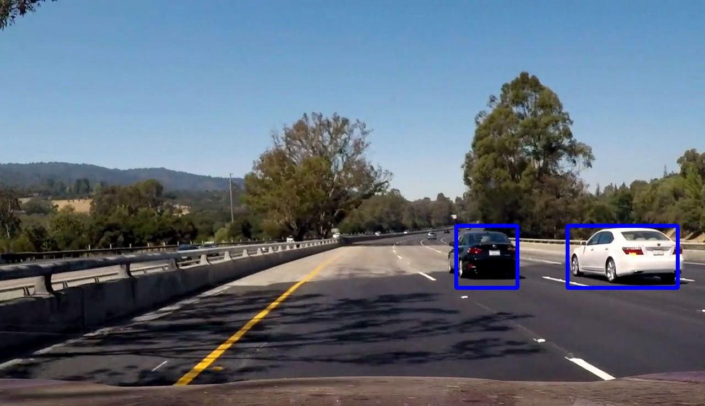

## Project 5: Vehicle Detection and Tracking

---

The goals / steps of this project are the following:

* Perform a Histogram of Oriented Gradients (HOG) feature extraction on a labeled training set of images and train a classifier Linear SVM classifier
* Optionally, you can also apply a color transform and append binned color features, as well as histograms of color, to your HOG feature vector. 
* Note: for those first two steps don't forget to normalize your features and randomize a selection for training and testing.
* Implement a sliding-window technique and use your trained classifier to search for vehicles in images.
* Run your pipeline on a video stream (start with the test_video.mp4 and later implement on full project_video.mp4) and create a heat map of recurring detections frame by frame to reject outliers and follow detected vehicles.
* Estimate a bounding box for vehicles detected.

## [Rubric](https://review.udacity.com/#!/rubrics/513/view) Points
###Here I will consider the rubric points individually and describe how I addressed each point in my implementation.  

---
###Writeup / README

####1. Provide a Writeup / README that includes all the rubric points and how you addressed each one.  You can submit your writeup as markdown or pdf.  [Here](https://github.com/udacity/CarND-Vehicle-Detection/blob/master/writeup_template.md) is a template writeup for this project you can use as a guide and a starting point.  

You're reading it! :)

###Histogram of Oriented Gradients (HOG)

####1. Explain how (and identify where in your code) you extracted HOG features from the training images.

The code for this step is contained in lines 52 through 58 of the file called `myUtils.py` and `85` through `94` in `myUtils.py`.  

I started by reading in all the `vehicle` and `non-vehicle` images.  Here is an example of one of each of the `vehicle` and `non-vehicle` classes:

Vehicle:

 

Not vehicle:

 

I then explored different color spaces and different `skimage.hog()` parameters (`orientations`, `pixels_per_cell`, and `cells_per_block`).  I grabbed random images from each of the two classes and displayed them to get a feel for what the `skimage.hog()` output looks like.

Here is an example using the color space and HOG parameters of `orientations=9`, `pixels_per_cell=(8, 8)` and `cells_per_block=(2, 2)`:

 

 

####2. Explain how you settled on your final choice of HOG parameters.

I tried various combinations of parameters and find the following good enough (emprically) for this project as they produced test classification results close to 100%: `orientation = 9`, `pixeks percell = 8`, `cells per block = 2`.

####3. Describe how (and identify where in your code) you trained a classifier using your selected HOG features (and color features if you used them).

I trained a linear SVM using spatial and HOG features. I also used color histogram during my experiments. However, color histogram did not impact results much which can be explained as cars have different colors and what is more important to detect cars is their shapes.
The corresponding codes are in lines `97` though `101` in `main.py`.

###Sliding Window Search

####1. Describe how (and identify where in your code) you implemented a sliding window search.  How did you decide what scales to search and how much to overlap windows?

The sliding window search has been implemented insie funtion `find_cars` in `myUtils.py` (lines `231` through `310`).
This part of code, slides a fixed size window (64x64)over an image of HOG features and crops out a patch with corresponding HOG features. 

To avoid calculating HOG for  an image over and over again, I used a fixed size window of size 64x64 pixels scaled down to 1.5 times, with 75% overlap. These values obtained emprically. larger or smaller values than `scale = 1.5` resulted in missing far and near vehicles.

####2. Show some examples of test images to demonstrate how your pipeline is working.  What did you do to optimize the performance of your classifier?

Ultimately I searched on a fixed scale using YCrCb 3-channel HOG features plus spatially binned color in the feature vector, which provided a nice result.  Here are some example images:

 
 
 
 

To improve the efficiency, I calculated the HOG features once for each frame and crops out corresponding sliding window patches. In addition, I searched for cars only in the lower half of the frame, where vehicles can exist, and  ignored anything above the horizon.

---

### Video Implementation

####1. Provide a link to your final video output.  Your pipeline should perform reasonably well on the entire project video (somewhat wobbly or unstable bounding boxes are ok as long as you are identifying the vehicles most of the time with minimal false positives.)
Here's a [link to my video result](./output_images/project_video_result_4.mp4)

####2. Describe how (and identify where in your code) you implemented some kind of filter for false positives and some method for combining overlapping bounding boxes.

I recorded the positions of positive detections in each frame of the video.  From the positive detections I created a heatmap and then thresholded that map to identify vehicle positions.  I then used `scipy.ndimage.measurements.label()` to identify individual blobs in the heatmap.  I then assumed each blob corresponded to a vehicle.  I constructed bounding boxes to cover the area of each blob detected.  

Here's an example result showing the heatmap from a series of frames of video, the result of `scipy.ndimage.measurements.label()` and the bounding boxes then overlaid on the last frame of video:

### Here are six frames and their corresponding heatmaps:

 

### Here is the output of `scipy.ndimage.measurements.label()` on the integrated heatmap from all six frames:
 

### Here the resulting bounding boxes are drawn onto the last frame in the series:
 

---

###Discussion

####1. Briefly discuss any problems / issues you faced in your implementation of this project.  Where will your pipeline likely fail?  What could you do to make it more robust?

Using fixed size window is not an optimal solution. It would be better to apply window search in multi scales (larger near the bottom of the frame and smaller near the horizon).
When two vehicles are very close together my approach misses one of them. Using Kalman filter will help to have more robust tracking especially when two vehicles are too close to eachother.

